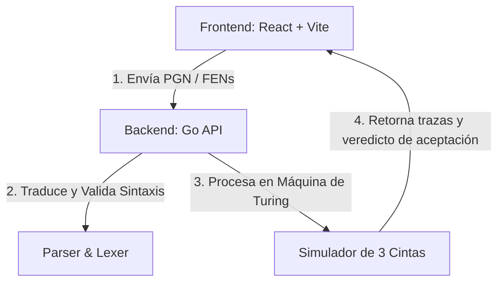

# Detector de Triple Repetición en Ajedrez ♟️🤖

Este proyecto es un analizador de lenguajes formales y simulador interactivo diseñado para detectar la **triple repetición** en partidas de ajedrez. Utiliza una arquitectura dividida en un backend de alto rendimiento en Go (que incluye un analizador léxico/sintáctico y una simulación de Máquina de Turing de 3 cintas) y un frontend moderno en React + TypeScript que permite visualizar paso a paso tanto el estado del tablero como las transiciones de la máquina de Turing.

---

## 🚀 Características Principales

- **Analizador Sintáctico de FEN Simplificado**: Implementa un compilador (Lexer y Parser) personalizado para validar la sintaxis de notaciones FEN simplificadas.
- **Simulador de Máquina de Turing de 3 Cintas**: Una Máquina de Turing multicinta formalizada para resolver el problema de la decisión de repeticiones en el historial de juego.
- **Visualizador de Cintas en Tiempo Real**: Consola interactiva en el frontend que permite reproducir, pausar y depurar paso a paso las transiciones, cabezales y contenidos de las 3 cintas de la Máquina de Turing.
- **Reproductor de Partidas (PGN)**: Interfaz intuitiva con tablero de ajedrez interactivo que permite navegar por la línea de tiempo de la partida y evaluar el veredicto de repetición en cada jugada.
- **Rendimiento Optimizado**: Carga bajo demanda y almacenamiento en caché de simulaciones detalladas para evitar sobrecarga de memoria.

---

## 🏗️ Arquitectura del Proyecto

El sistema está dividido en dos componentes principales:



### 1. Backend (`/backend`)
Construido en **Go**, proporciona endpoints REST rápidos para el análisis de partidas completas y la simulación interactiva de movimientos individuales:

- **Lexer & Parser (`/backend/parser`)**: Valida la gramática formal del FEN simplificado:
  ```text
  <FEN>        ::= <Board> "|" <Turn> "|" <Castling> "|" <EnPassant>
  <Board>      ::= <Row> "/" <Row> "/" <Row> "/" <Row> "/" <Row> "/" <Row> "/" <Row> "/" <Row>
  <Row>        ::= <Element>+
  <Element>    ::= TK_PIEZA | TK_NUMERO
  <Turn>       ::= TK_TURNO
  <Castling>   ::= TK_ENROQUE+ | "-"
  <EnPassant>  ::= TK_ENPASSANT
  ```
- **Traductor PGN (`/backend/translator`)**: Convierte notaciones estándar PGN (Portable Game Notation) a la secuencia histórica de FENs simplificados.
- **Máquina de Turing (`/backend/turing`)**: Simulación formal de una máquina con 3 cintas:
  - **Cinta 1**: Historial de FENs del juego (`$FEN1$FEN2$...$`).
  - **Cinta 2**: FEN de la posición actual a comprobar (`$FEN_actual$`).
  - **Cinta 3**: Contador de coincidencias (almacena marcas `1` para contar repeticiones).
  - **Estados principales**: `q_init`, `q_cmp`, `q_rebobinarC2`, `q_saltarC1`, `q_rewindC3`, `q_countC3`, `q_accept`, `q_reject`.

### 2. Frontend (`/frontend`)
Desarrollado en **React 19**, **TypeScript**, **Vite** y estilizado con **TailwindCSS**:

- **Tablero de Ajedrez**: Renderizado interactivo y automático de la posición de la partida mediante `react-chessboard`.
- **Línea de Tiempo**: Panel de navegación de jugadas de la partida con indicadores visuales de alertas en jugadas que causan triple repetición.
- **Consola de Turing**: Representación gráfica del estado interno de la máquina (lectura, escritura, movimiento del cabezal en cada una de las 3 cintas).
- **Depurador de Pasos**: Modal con la lista completa de pasos de la máquina para auditar el flujo de transiciones de los estados.

---

## 🛠️ Instalación y Configuración

### Requisitos Previos
- **Go** (versión 1.22 o superior)
- **Node.js** (versión 18 o superior) e **npm**

---

### Paso 1: Configurar y Ejecutar el Backend (Go)

1. Dirígete a la carpeta del backend:
   ```bash
   cd backend
   ```
2. Instala las dependencias necesarias:
   ```bash
   go mod download
   ```
3. Ejecuta el servidor de desarrollo:
   ```bash
   go run main.go
   ```
   El backend se iniciará en `http://localhost:8080`.

---

### Paso 2: Configurar y Ejecutar el Frontend (React)

1. Abre una nueva terminal y dirígete a la carpeta del frontend:
   ```bash
   cd frontend
   ```
2. Instala los paquetes de Node:
   ```bash
   npm install
   ```
3. Inicia el servidor de desarrollo local de Vite:
   ```bash
   npm run dev
   ```
   El frontend estará disponible en `http://localhost:5173`.

---

## 📖 Ejemplo de Uso

1. Copia una partida en formato PGN. El software viene precargado con tres ejemplos rápidos:
   - **Cargar Repetición**: Una partida real que entra en triple repetición y es detectada.
   - **Cargar Rep. Corta**: Un vaivén rápido de caballos (`1. Nf3 Nf6 2. Ng1 Ng8 3. Nf3 Nf6 4. Ng1 Ng8`).
   - **Cargar Mate del Pastor**: Una partida corta convencional sin repeticiones de estados.
2. Presiona **Analizar Partida**.
3. Navega por la línea de tiempo de jugadas. El tablero y el estado de la Máquina de Turing se sincronizarán automáticamente.
4. En jugadas repetidas, podrás ver cómo la Máquina de Turing rebobina y escribe `1`s en la Cinta 3 hasta decidir la aceptación (`q_accept`) o el rechazo (`q_reject`).

---

## 📄 Licencia

Este proyecto fue desarrollado con fines educativos para la asignatura de Lenguajes Formales.
