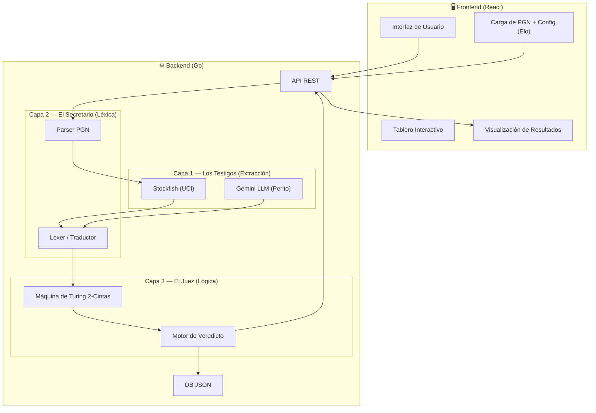
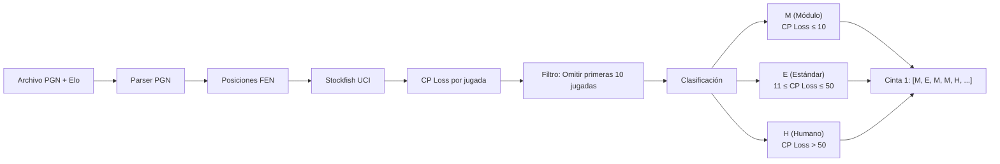
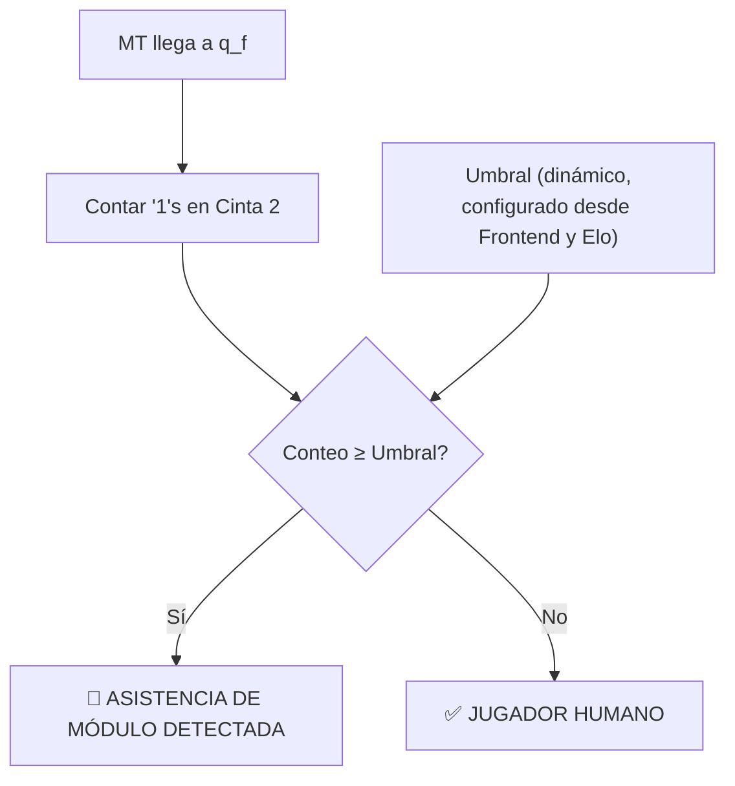

# Arquitectura del Sistema

> **M-TurinChess** — Detección de Módulos en Ajedrez mediante Máquina de Turing

## Visión General

El sistema sigue una analogía de **Tribunal Judicial** compuesta por tres capas independientes, cada una con una responsabilidad única y bien definida.

---

## Capa 1 — Los Testigos (Extracción de Evidencia)

### Stockfish (Testigo Principal)

- **Rol:** Evalúa cada jugada del humano comparándola con la jugada óptima.
- **Protocolo:** UCI (Universal Chess Interface) vía subproceso.
- **Output:** **CP Loss** (Pérdida de Centipeones) por cada jugada.
- **Ejemplo:** Si Stockfish dice que la mejor jugada vale `+1.20` y el humano jugó una que vale `+0.80`, el CP Loss = `40`.

### Gemini LLM (Perito Psicológico)

- **Rol:** Analiza jugadas con `0 CP Loss` que podrían ser "inhumanamente perfectas".
- **Criterio:** Evalúa en contexto del **Elo del jugador** (por ejemplo, un jugador de 1200 haciendo jugadas que Stockfish aprobaría). Si la jugada es matemáticamente incomprensible para un humano de ese nivel, la clasifica como sospechosa.
- **Integración:** Llamada a la API de Gemini a través del backend de Go (proxy seguro).

---

## Capa 2 — El Secretario (Capa Léxica)

El backend en Go actúa como traductor, convirtiendo la evidencia cruda en un lenguaje formal que la Máquina de Turing pueda procesar.

### Pipeline de Traducción

### Alfabeto Formal

| Símbolo | Nombre | CP Loss | Significado |
|---------|--------|---------|-------------|
| `M` | Módulo | 0–10 | Jugada computacionalmente perfecta |
| `E` | Estándar | 11–50 | Jugada humana razonable |
| `H` | Humano/Mediocre | > 50 | Error humano evidente |

### Regla de Filtrado

Se omiten las **primeras 10 jugadas** (20 plies) dependiendo del Elo, ya que la teoría de aperturas produce jugadas perfectas.

---

## Capa 3 — El Juez (Motor de Decisión)

La Máquina de Turing es un **módulo completamente aislado**:

- ❌ No tiene acceso a internet.
- ❌ No tiene acceso a Stockfish.
- ❌ No conoce el contexto de ajedrez (Elo o tableros).
- ✅ Solo recibe una cadena del alfabeto `{M, E, H}`.
- ✅ Solo opera con su tabla de transiciones.
- ✅ Solo emite un conteo de `1`s en la Cinta 2.

### Flujo de Decisión Post-MT

> **Nota:** El umbral es **dinámico y configurable**.

---

## Decisiones Arquitectónicas

| Decisión | Elección | Justificación |
|----------|----------|---------------|
| Lenguaje Backend | **Go** | Concurrencia nativa, compilación rápida |
| Frontend | **React** | Interactividad, modularidad, ecosistema rico (react-chessboard) |
| Motor de Ajedrez | **Stockfish (local)** | Estándar de la industria, protocolo UCI |
| Base de Datos | **JSON Local** | Persistencia simple para historial sin sobre-ingeniería |
| LLM | **Gemini API** | Peritaje para contextos humanos de Elo |
| Estructura | **Separada** | `backend/` para Go, `frontend/` para React |
