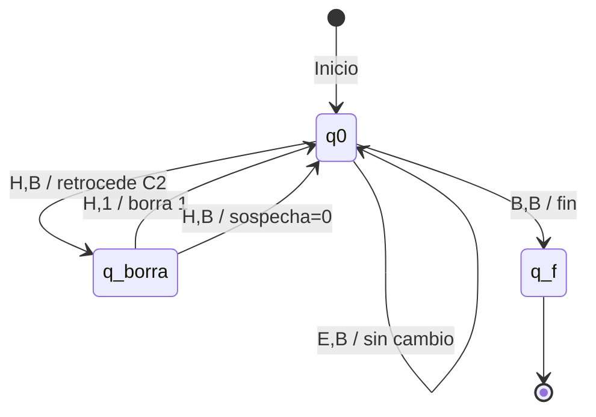

# Especificación Formal — Máquina de Turing de 2 Cintas

> **El Juez** — Motor de decisión aislado del sistema M-TurinChess.

## 1. Definición Formal (7-Tupla)

$$M = (Q, \Sigma, \Gamma, \delta, q_0, B, F)$$

| Componente | Definición | Descripción |
|------------|-----------|-------------|
| $Q$ | $\{q_0, q_{borra}, q_f\}$ | Conjunto finito de estados |
| $\Sigma$ | $\{M, E, H\}$ | Alfabeto de entrada |
| $\Gamma$ | $\{M, E, H, 1, B\}$ | Alfabeto de cinta |
| $\delta$ | Ver tabla §3 | Función de transición |
| $q_0$ | $q_0$ | Estado inicial |
| $B$ | $B$ | Símbolo blanco |
| $F$ | $\{q_f\}$ | Conjunto de estados finales |

---

## 2. Cintas

### Cinta 1 — Entrada (Solo Lectura)

- Cadena generada por el Lexer. Ej: `[M, E, M, M, H, E, M, B]`
- Cabezal: siempre `R` (derecha) o `S` (pausa). Nunca retrocede.

### Cinta 2 — Memoria de Trabajo (Pila)

- Inicializada en blanco: `[B, B, B, ...]`
- Codificación **unaria**: cada `1` = una unidad de sospecha.
- Movimiento **bidireccional** (`L`, `R`, `S`).
- Mecánica de **Stack**: Push (escribe `1`, mueve `R`) / Pop (retrocede `L`, borra `1`).

---

## 3. Tabla de Transiciones

| # | Estado | Lee C1 | Lee C2 | → Estado | Esc. C1 | Mov C1 | Esc. C2 | Mov C2 | Justificación |
|---|--------|--------|--------|----------|---------|--------|---------|--------|---------------|
| 1 | $q_0$ | `M` | `B` | $q_0$ | `M` | `R` | `1` | `R` | Módulo → +1 sospecha |
| 2 | $q_0$ | `E` | `B` | $q_0$ | `E` | `R` | `B` | `S` | Estándar → sin cambio |
| 3 | $q_0$ | `H` | `B` | $q_{borra}$ | `H` | `S` | `B` | `L` | Humano → pausa C1, retrocede C2 |
| 4 | $q_{borra}$ | `H` | `1` | $q_0$ | `H` | `R` | `B` | `S` | Borra 1 (-1 sospecha), reanuda |
| 5 | $q_{borra}$ | `H` | `B` | $q_0$ | `H` | `R` | `B` | `S` | Sospecha=0, nada que borrar |
| 6 | $q_0$ | `B` | `B` | $q_f$ | `B` | `S` | `B` | `S` | Fin de partida → acepta |

---

## 4. Diagrama de Estados

---

## 5. Traza Visual — Ejemplo

**Entrada C1:** `[M, M, E, H, M, M, H, B]`

| Paso | Estado | Lee C1 | Lee C2 | Sospecha | Acción |
|------|--------|--------|--------|----------|--------|
| 0 | $q_0$ | `M` | `B` | 0 → 1 | Escribe 1, avanza ambas |
| 1 | $q_0$ | `M` | `B` | 1 → 2 | Escribe 1, avanza ambas |
| 2 | $q_0$ | `E` | `B` | 2 | Sin cambio, avanza C1 |
| 3 | $q_0$ | `H` | `B` | 2 | Pausa C1, retrocede C2 → $q_{borra}$ |
| 4 | $q_{borra}$ | `H` | `1` | 2 → 1 | Borra 1, avanza C1 → $q_0$ |
| 5 | $q_0$ | `M` | `B` | 1 → 2 | Escribe 1, avanza ambas |
| 6 | $q_0$ | `M` | `B` | 2 → 3 | Escribe 1, avanza ambas |
| 7 | $q_0$ | `H` | `B` | 3 | Pausa C1, retrocede C2 → $q_{borra}$ |
| 8 | $q_{borra}$ | `H` | `1` | 3 → 2 | Borra 1, avanza C1 → $q_0$ |
| 9 | $q_0$ | `B` | `B` | **2** | Fin → $q_f$ |

**Resultado:** Sospecha = **2**

---

## 6. Mecánica del Cabezal C2

El cabezal de C2 **siempre termina sobre un `B`**, eliminando la necesidad de navegar:

**Push (M):** `[1, 1, >B] → escribe 1, R → [1, 1, 1, >B]`

**Pop (H):** Dos pasos:
1. `[1, 1, >B] → L → [1, >1, B]`
2. `[1, >1, B] → escribe B, S → [1, >B, B]`

**Skip (E):** `[1, 1, >B] → S → [1, 1, >B]` (sin cambios)

**Caso borde (sospecha=0):** `[>B] → L → choca borde → [>B]` → regla 5 reanuda sin borrar.

---

## 7. MT vs. Autómata Finito

| Criterio | DFA | Máquina de Turing |
|----------|-----|-------------------|
| Memoria | ❌ Sin memoria auxiliar | ✅ Cinta de trabajo |
| Conteo arbitrario | ❌ Estados exponenciales | ✅ Codificación unaria |
| Suma/Resta dinámica | ❌ Impracticable | ✅ Push/Pop natural |
| Estados requeridos | ∞ (uno por nivel) | **3 estados** |
