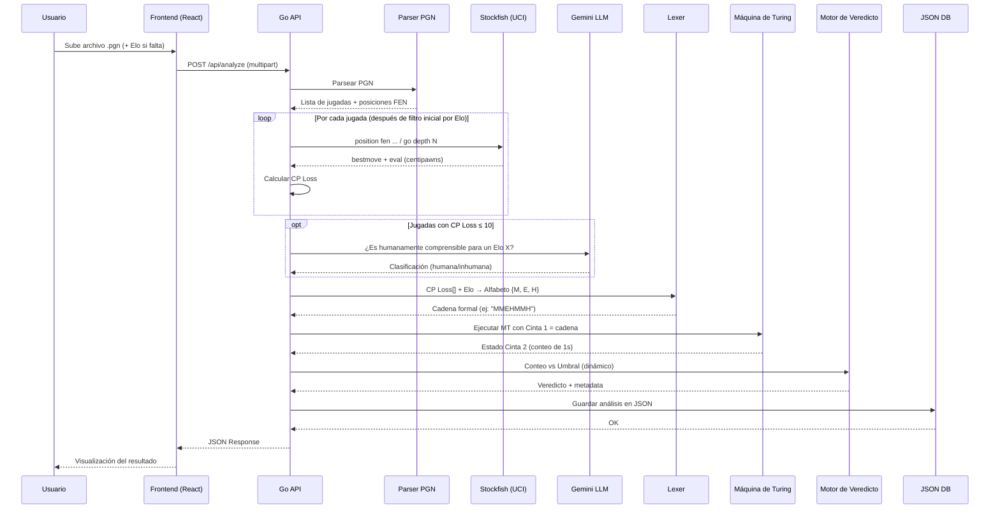
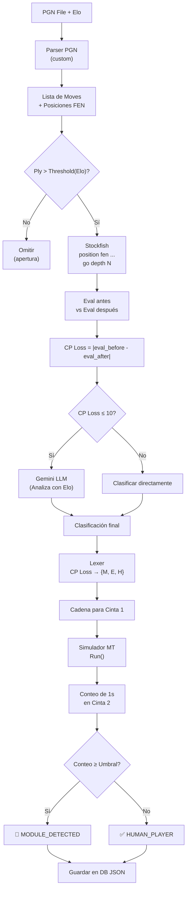

# Flujo de Datos — End to End

> Desde el archivo PGN hasta el veredicto final.

## Flujo Completo



---

## Estructura del Request

### `POST /api/analyze`

```
Content-Type: multipart/form-data

Fields:
  - pgn_file: archivo .pgn
  - player_color: "white" | "black"
  - elo_white: integer (detectado o ingresado)
  - elo_black: integer (detectado o ingresado)
  - threshold: integer (umbral configurable)
  - depth: integer (profundidad de análisis Stockfish, default: 18)
```

---

## Estructura del Response

```json
{
  "verdict": "MODULE_DETECTED" | "HUMAN_PLAYER",
  "suspicion_count": 8,
  "threshold": 6,
  "total_moves_analyzed": 30,
  "tape_input": ["M", "E", "M", "M", "H", "E", "M", "M", "..."],
  "tape_output": ["1", "1", "1", "1", "1", "1", "1", "1", "B", "B"],
  "move_details": [
    {
      "move_number": 11,
      "san": "Nf3",
      "cp_loss": 3,
      "classification": "M",
      "best_move": "Nf3",
      "llm_flag": null
    }
  ],
  "mt_trace": [
    {
      "step": 0,
      "state": "q0",
      "read_c1": "M",
      "read_c2": "B",
      "action": "write 1, move R",
      "suspicion": 1
    }
  ]
}
```

---

## Pipeline Interno (Go)


