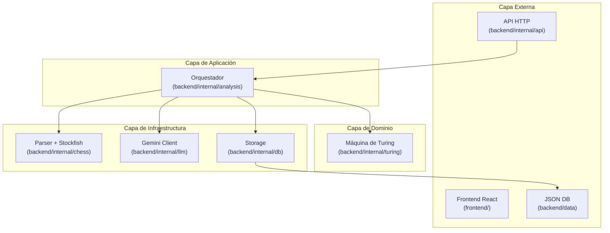

# Estructura del Proyecto

> Clean Architecture simplificada con separación Frontend/Backend.

## Árbol de Directorios

```
M-TurinChess/
├── backend/                        # Backend (Go)
│   ├── cmd/
│   │   └── server/
│   │       └── main.go             # Punto de entrada de la aplicación
│   │
│   ├── internal/                   # Código privado del proyecto
│   │   ├── chess/                  # Capa de Extracción (Los Testigos)
│   │   │   ├── pgn.go              # Parser PGN custom
│   │   │   ├── stockfish.go        # Cliente UCI para Stockfish
│   │   │   └── lexer.go            # Traductor CP Loss + Elo → {M, E, H}
│   │   │
│   │   ├── turing/                 # Capa Lógica (El Juez) — AISLADO
│   │   │   ├── machine.go          # Simulador MT de 2 cintas
│   │   │   └── transitions.go      # Tabla de transiciones δ
│   │   │
│   │   ├── analysis/               # Orquestador (conecta Testigos + Juez)
│   │   │   └── analyzer.go         # Pipeline completo de análisis
│   │   │
│   │   ├── llm/                    # Integración con Gemini
│   │   │   └── gemini.go           # Cliente API de Gemini (Perito)
│   │   │
│   │   ├── db/                     # Capa de Persistencia
│   │   │   └── json_storage.go     # Manejo del historial de análisis en JSON
│   │   │
│   │   └── api/                    # Capa HTTP (El Secretario expone)
│   │       ├── handler.go          # Handlers de la API
│   │       ├── router.go           # Rutas
│   │       └── middleware.go       # CORS, logging, etc.
│   │
│   ├── data/                       # Almacenamiento de BD JSON
│   │   └── history.json            # Base de datos basada en JSON
│   │
│   ├── stockfish/                  # Motor Stockfish (binario)
│   │   └── stockfish-windows-x86-64-avx2.exe
│   │
│   ├── go.mod
│   └── go.sum
│
├── frontend/                       # Frontend (React)
│   ├── src/
│   │   ├── components/
│   │   │   ├── Board.jsx           # Tablero interactivo (react-chessboard)
│   │   │   ├── PgnUploader.jsx     # Drag & drop PGN + Input de Elo
│   │   │   └── Results.jsx         # Visualización MT y veredicto
│   │   ├── api/
│   │   │   └── client.js           # Cliente HTTP hacia Go
│   │   ├── App.jsx
│   │   └── main.jsx
│   │
│   ├── public/
│   ├── package.json
│   └── vite.config.js
│
├── docs/                           # Documentación
│   ├── 01-architecture.md
│   ├── 02-turing-machine.md
│   ├── 03-data-flow.md
│   ├── 04-project-structure.md     # (este archivo)
│   └── 05-roadmap.md
│
├── testdata/                       # PGNs de prueba
│   └── (archivos .pgn de ejemplo)
│
├── PRD.md
├── README.md
└── LICENSE
```

---

## Principios de Diseño

### Clean Architecture (Simplificada)



### Reglas de Dependencia en el Backend

| Paquete | Puede importar | NO puede importar |
|---------|---------------|-------------------|
| `internal/turing` | Nada (dominio puro) | chess, api, analysis, llm, db |
| `internal/chess` | Nada externo al paquete | turing, api, analysis, db |
| `internal/llm` | Nada externo al paquete | turing, api, analysis, db |
| `internal/db` | Nada externo al paquete | turing, api, analysis |
| `internal/analysis` | turing, chess, llm, db | api |
| `internal/api` | analysis | chess, turing, db (directamente) |
| `cmd/server` | api | todo lo demás directamente |

> **La regla más importante:** `internal/turing` es **100% independiente**. No importa ningún otro paquete del proyecto. Es una librería genérica de simulación de MT.
